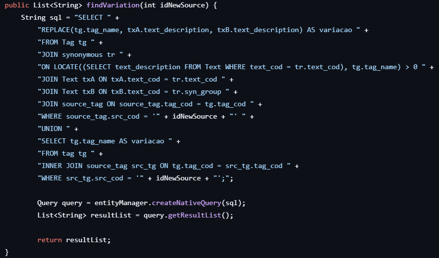

## 
Introdução

### 
 Quem sou eu?

Sou Vinícius Monteiro, estudante de Banco de Dados na FATEC São José dos Campos, atualmente no 4º semestre. Entrei na área da tecnologia em 2022, onde iniciei o curso de Análise e Desenvolvimento de Sistemas, finalizando o curso em dezembro de 2023. Estou no mercado de trabalhode tecnologia da informação há 2 anos, iniciando minha carreira como estagiário de Ciencia da Computação na prefeitura de São José dos Campos, atuando como desenvolvedor fullstack por 7 meses. Agora ocupo a posição de programador junior na empresa SIMOVA, fazendo parte do time há 1 ano e 7 meses.

###  
Contatos

 

 

##  
Meus Projetos

### Coderhood - 1º Semestre

No primeiro semestre, o desafio proposto foi desenvolver uma plataforma voltada para professores, com o entuito de facilitar a gestão de sprints, tratando os scores de grupos de alunos e dos alunos em si. 

 

#### Tecnologias Utilizadas

  
  
  
  
  
  
  
  
  

#### Contribuições Pessoais

Neste semestre, atuei como PO da equipe coderhood, ajudando no levantamento de requisitos e regras de negócio do projeto, qual era voltado para uma plataforma para auxiliar professores a organizar e controlar as notas (scores) dos alunos em sprints dos projetos. Também, pariticipei diretamente do desenvolvimento do projeto, atuando como desenvolvedor fullstack.

### Morpheus - 3º Semestre

No terceiro semestre, a empre GSW nos propôs um desafio: Desenvolver um sistema capaz de buscar noticias em portais e armazenar as informações encontradas de acordos com palavras chaves e seus sinonimos. 

 

#### Tecnologias Utilizadas

  
  
  
  
  
  
  
  
  
  
  
  
  

 

#### Contribuições Pessoais 

Atuei como desenvolvedor web backend da aplicação, levantando a modelagem do banco de dados, onde utilizamos o mySQL como sistema gerenciador. Utilizamos Java como linguagem de programação juntamente com springboot, integrando com o frontend para que o usuario pudesse fazer a utilização da aplicação com mais facilidade. Todas os metodos de cadastro, edição, exclusão e listagem foram integrados com axios, garantindo a persistência e sincronia dos dados entre o front-end e o banco de dados.
 
Minhas principais entregas incluiram:

 

- Configuração do banco de dados:
  
  - Desenvolvimento da Entidade e Relacionamento.
  - Configuração do banco nos properties.
  
- Metodo de busca por tags:

  - Query que relacionava a tag com seus sinonimos, retornando as informações deste relacionamento. Ex.: O usuário adicionava a tag e seus sinonimos ('mandioca', 'macaxeira', 'aipim'). 
  - Associação de tags temáticas aos portais para facilitar a organização e filtragem.

  

- Filtro de noticias:

  - Busca por portais, títulos, autor, intervalo de datas de publicações.
  - Devendo buscar entradas multiplas.
  - Paginação: limitando a quantidade de dados de maneira dinâmica.

- Aprimoramento técnico:

  - Revisão de códigos - ajuste de redundância, melhora nas nomenclaturas de variáveis e rotas, aplicação do SOLID.
  - Melhorias em exceptions, tornando a identificação de erros mais clara.  

#### Hard Skills 

- PostgreSQL - Trabalhei com querys complexas, que otimizavam consultas e facilitaram o desenvolvimenteo. Além do levantamento do requisitos para a criação do DER.
- JAVA - Desenvolvimento de metodos, trabalhando lógica de programação e conceitos de padrões de projeto.
- Git / Github – Participei do controle de versionamneto do código fonte, com commits e branches padronizadas e resolução de conflitos.
- Vue.js - Implementações de interfaces buscando a melhor experiência para o usuário.

 

#### Soft Skills

- Produtividade - Entrega de tarefas dentro dos prazos, capacidade de manter o foco em metas claras, organizando prioridades com base nas demandas da sprint.
- Proatividade -  Fui responsável por atuar diretamente na implementação de novas funcionalidades back-end e front-end. Sempre consciliando isso com comunicação ativa para que a entrega estivesse sempre alinhada com a entrega do produto.
- Colaboração - Participei ativamente das reuniões de planejamento, refinamento e retrospectiva, contribuindo com sugestões para melhorar a experiência do usuário, organizar a integração com APIs
- Entrega de resultados - Cada tarefa desenvolvida foi pensada para gerar valor ao usuário final, desde a interface até a funcionalidade. A clareza dos objetivos, a comunicação contínua com o time e a responsabilidade com as entregas foram fundamentais para transformar planejamento em solução concreta, funcionando em ambiente real e validado pela equipe.
  

